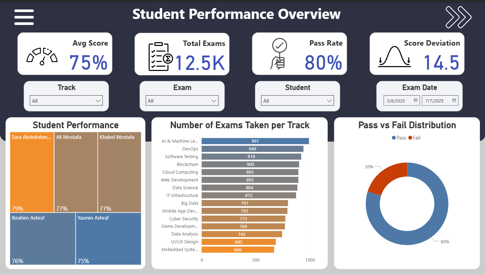
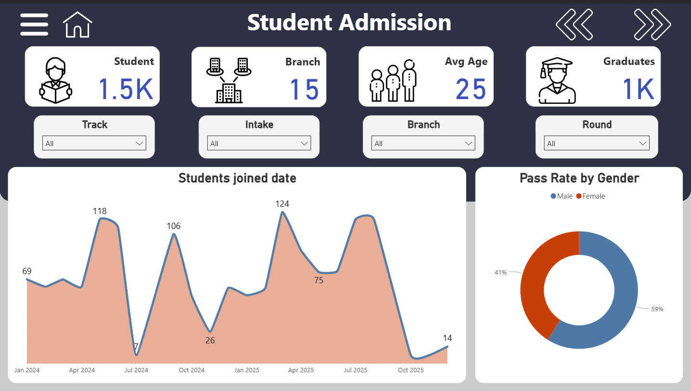
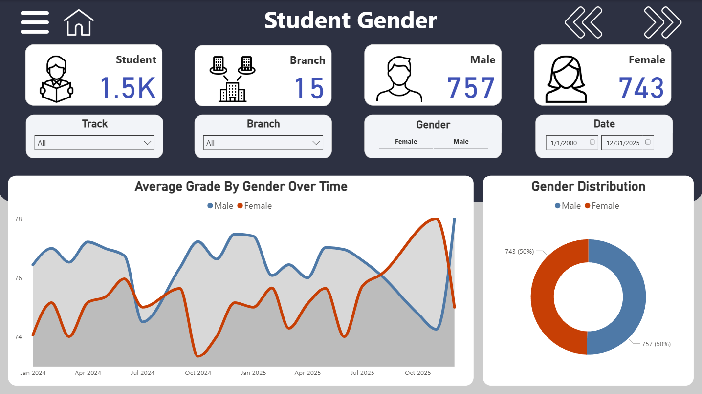

# 📘 Examination System Project

## 📝 Description
An automated online exam system designed for ITI students, covering the full data pipeline from database design to reporting and dashboards.  
This project simulates a real-world BI solution including data modeling, ETL, DWH, and final dashboard visualization.

---

## 🧰 Technologies Used

- SQL Server (Database & Stored Procedures)
- SSIS (ETL Tool)
- SSAS (Multidimensional Cubes)
- SSRS (Reports)
- Power BI (Dashboards)
- Excel
- Data Warehouse Concepts

---

## 📁 Project Structure

| Folder / File | Description |
|---------------|-------------|
| `creation_DB.sql` | SQL script to create the database schema |
| `exam_procedures.sql` | Stored procedures used in the system |
| `DB.bak` | Backup of the SQL Server database |
| `SSIS/` | ETL packages to move and transform data |
| `SSAS/` | Cube definitions for analytical processing |
| `SSRS/` | Report templates and outputs |
| `Dashboards/` | Power BI dashboards and reports |
| `Reports/` | Sample output reports |
| `Documentation.docx`, `ERD-Last.drawio.pdf` | System documentation and ERD diagrams |

---

## 🧠 Key Features

- Full Online Examination System
- Advanced SQL procedures, triggers & functions
- Data extraction, transformation & loading (ETL) via SSIS
- Multidimensional cubes using SSAS
- Final reporting using both SSRS and Power BI
- Clean documentation and ER diagrams

---

## 🖥️ Screenshots

### 📊 Dashboard Sample 1

### 📈 Dashboard Sample 2

### 📉 Dashboard Sample 3

---

## 🚀 How to Run

1. Restore the `DB.bak` file on SQL Server.
2. Execute stored procedures from `exam_procedures.sql`.
3. Load and run ETL packages from `SSIS/`.
4. Connect SSAS and browse the cube.
5. View SSRS or Power BI dashboards in respective folders.

---

## 📫 Contact

- 📧 omarmatook1@gmail.com  
- 🔗 [LinkedIn](https://www.linkedin.com/in/omar-maatouk-659bb7229)
